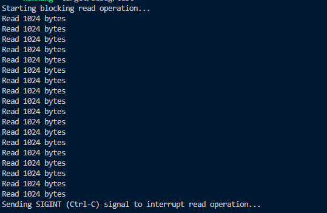
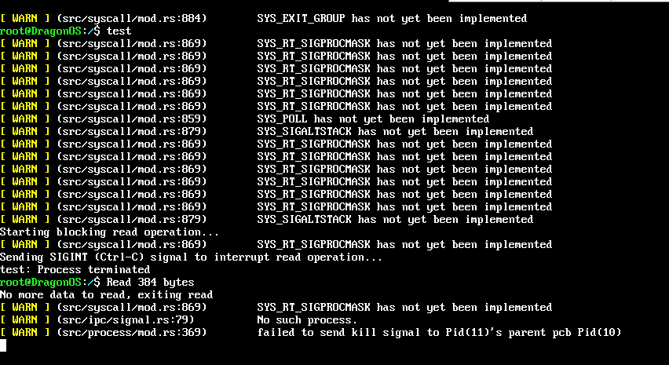

---
# 信号发送与处理详解
## 1. 信号如何发送给目标进程
信号可以通过多种事件生成，例如：
- 用户按下特定的组合键（如 Ctrl+C 生成 SIGINT）。
- 硬件异常（如除零错误生成 SIGFPE）。
- 进程调用 `kill()` 系统调用发送信号。
- 定时器到期（如 SIGALRM）。
信号传递给进程的过程如下：
1. 当信号生成后，内核会将信号记录在目标进程的信号位图中，对应下面的结构
```rust
#[derive(Debug, Default)]
pub struct SigPending {
    signal: SigSet,
    queue: SigQueue,
}
```
2. 然后，内核会在适当的时机调用```signal_pending()```来处理挂起的信号。这个时机通常是目标进程从内核态返回到用户态时。
## 2. 信号的处理方法
- 如果进程为该信号设置了信号处理函数（signal handler），内核会调用该处理函数。
- 如果进程没有为该信号设置信号处理函数，内核会执行默认的信号处理动作（如终止进程、忽略信号等）。
## 3. [PR889](https://github.com/DragonOS-Community/DragonOS/pull/889)修复管道Bug的原因
目前尚未实现系统调用重启机制，如果系统调用返回一个 `ERESTARTSYS` 错误，会导致系统调用无法完成，使得进程状态异常，进程可能会因为资源耗尽或其他原因而被终止。上述 PR 将返回的 `ERESTARTSYS` 错误直接转换为 `EINTR`，明确用户态程序需要重新执行系统调用以解决错误。

上面说的是针对vfs的暂时的处理方法
而对于pr中修复的pipe文件的问题，则是通过查看pipe_inode的情况来检查是否可读或可写，如果不可读不可写则会调用`wq_wait_event_interruptible!`宏来等待，使进程等待队列中睡眠，直到等待条件达成才会重新唤醒该进程，使进程重新进入执行状态，并且由于这个过程可以中断，仍可以kill进程
这个时候如果kill进程的话则会返回结果`Err(SystemError::ERESTARTSYS)`，但是未实现系统调用重启机制，则仍是交给用户态程序处理
## 4. 如何复现 read、write 的问题
以下代码模拟了 `read` 操作，展示了如何复现问题：
```rust
use libc::{fcntl, F_SETFL};
use nix::sys::signal::{kill, Signal};
use nix::unistd::Pid;
use std::fs::{remove_file, File};
use std::io::{Read, Result, Write};
use std::os::unix::io::{AsRawFd, FromRawFd};
use std::sync::{Arc, Mutex};
use std::thread;
use std::time::Duration;

fn main() -> Result<()> {
    // Create and write to a large file
    let filename = "large_file.txt";
    {
        let mut file = File::create(filename)?;
        for _ in 0..10_000 {
            writeln!(file, "This is a line of text.")?;
        }
    }

    // Open the file for reading
    let mut file = File::open(filename)?;
    let fd = file.as_raw_fd();

    // Ensure the read operation is blocking
    unsafe {
        fcntl(fd, F_SETFL, 0); // Set to blocking mode
    }

    // Used to store the read byte data
    let buffer = Arc::new(Mutex::new(vec![0u8; 1024])); // Use a larger buffer
    let buffer_clone = Arc::clone(&buffer);

    // Thread 1: Simulate a blocking read operation
    let handle = thread::spawn(move || {
        let mut file = unsafe { File::from_raw_fd(fd) }; // Create file from raw file descriptor
        println!("Starting blocking read operation...");
        loop {
            let mut buffer_lock = buffer_clone.lock().unwrap();
            match file.read(&mut *buffer_lock) {
                Ok(0) => {
                    println!("No more data to read, exiting read");
                    break;
                }
                Ok(n) => {
                    // Output the number of bytes read, occupying the entire line
                    //if n != 1024 {
                        let output = format!("Read {} bytes", n);
                        println!("{:<width$}", output, width = 80); // Adjust width as needed
                    //}
                }
                Err(e) => {
                    eprintln!("Read failed: {:?}", e);
                    break;
                }
            }
        }
    });

    // Thread 2: Delay sending SIGINT (Ctrl-C) signal to interrupt the blocking `read`
    thread::sleep(Duration::new(0, 5_0000));
    println!("Sending SIGINT (Ctrl-C) signal to interrupt read operation...");
    let pid = Pid::this();
    kill(pid, Signal::SIGINT).expect("Failed to send signal");

    handle.join().expect("Error in read thread");

    // Delete the temporary file
    remove_file(filename).expect("Failed to delete file");

    Ok(())
}
```
在 Linux 上执行时，收到 Ctrl+C 会导致程序立即终止。

但在 DragonOS 中执行时，可以看到即使程序终止，它仍然会继续读取。

---

